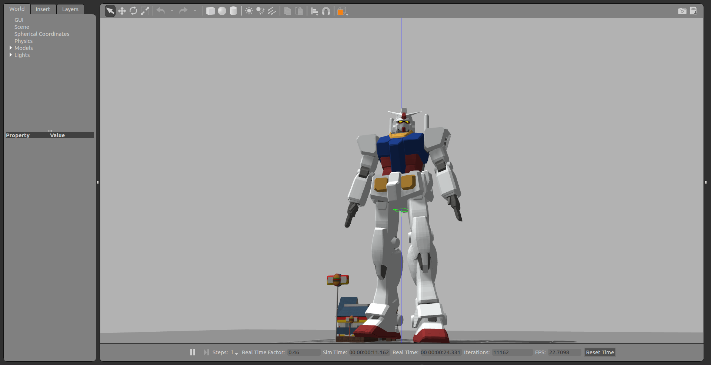

gundam_robot [](https://travis-ci.com/gundam-global-challenge/gundam_robot)
========================================================================================================================================================================
ROS packages for GUNDAM robots



How to visualize URDF model
===========================

To visualize URDF file in your rviz, you can use `display.launch` file.
```
$ roslaunch gundam_rx78_description display.launch
```

How to run gazebo simulation
============================

To run a gazebo dynamics simulation, you can start `gundam_rx78_world.launch`.

```
$ roslaunch gundam_rx78_gazebo gundam_rx78_world.launch
```

To control joint angles, try a sample script.

```
# move upper body
$ rosrun gundam_rx78_control joint_trajectory_client_example.py
```

Experimental
------------

You can run "Robot"-like walking pattern on simulation

```
$ roslaunch gundam_rx78_gazebo gundam_rx78_walk.launch
```

```
# step
$ rosrun gundam_rx78_control joint_trajectory_client_csv.py `rospack find gundam_rx78_control`/sample/csv/step.csv
# walk forward
$ rosrun gundam_rx78_control joint_trajectory_client_csv.py `rospack find gundam_rx78_control`/sample/csv/walk-forward.csv
# walk backward
$ rosrun gundam_rx78_control joint_trajectory_client_csv.py `rospack find gundam_rx78_control`/sample/csv/walk-backward.csv
# walk to right
$ rosrun gundam_rx78_control joint_trajectory_client_csv.py `rospack find gundam_rx78_control`/sample/csv/walk-to-right.csv
# walk to left
$ rosrun gundam_rx78_control joint_trajectory_client_csv.py `rospack find gundam_rx78_control`/sample/csv/walk-to-left.csv
# turn right
$ rosrun gundam_rx78_control joint_trajectory_client_csv.py `rospack find gundam_rx78_control`/sample/csv/turn-right.csv
# turn left
$ rosrun gundam_rx78_control joint_trajectory_client_csv.py `rospack find gundam_rx78_control`/sample/csv/turn-left.csv
```

Note that currently, we have several limitation on this simulation, we only have position controller etc.

You can also find sample motion control files in the `gundam_rx78_control/sample` directory.

For Developers Only
===================

How to setup workspace
----------------------

We recommend you to use `wstool` to setup you workspace.

```
$ mkdir -p catkin_ws/src
$ cd  catkin_ws
$ wstool init src
$ wstool merge -t src https://raw.githubusercontent.com/gundam-global-challenge/gundam_robot/.gundam.rosinstall
$ wstool update -t src
$ source /opt/ros/$ROS_DISTRO/setup.bash
$ rosdep install -y -r --from-paths src --ignore-src
$ catkin build
$ source devel/setup.bash
```

How to install mesh and urdf file
---------------------------------

The Gundam URDF file is automatically generated from Collada DAE file.

First, download the Gundam Collada file (ex. `GGC_TestModel_rx78_20170112.DAE`) under `gundam_rx78_description` directory.
Then, run `./scripts/dae_to_urdf.py` file with the downloaded file name as an argument. This will create mesh files under `meshes/` directory and create the URDF file under `urdf/` directory.

Finally, rename the file name to `urdf/gundam_rx78.urdf`

```
$ roscd gundam_rx78_description
$ python ./scripts/ggc_dae_to_urdf.py GGC_TestModel_rx78_20170112.DAE --write_mesh
$ mv urdf/GGC_TestModel_rx78_20170112.urdf urdf/gundam_rx78.urdf
```
You have to use urdf_parser_py version 0.4.0 instead of version 0.4.1.
